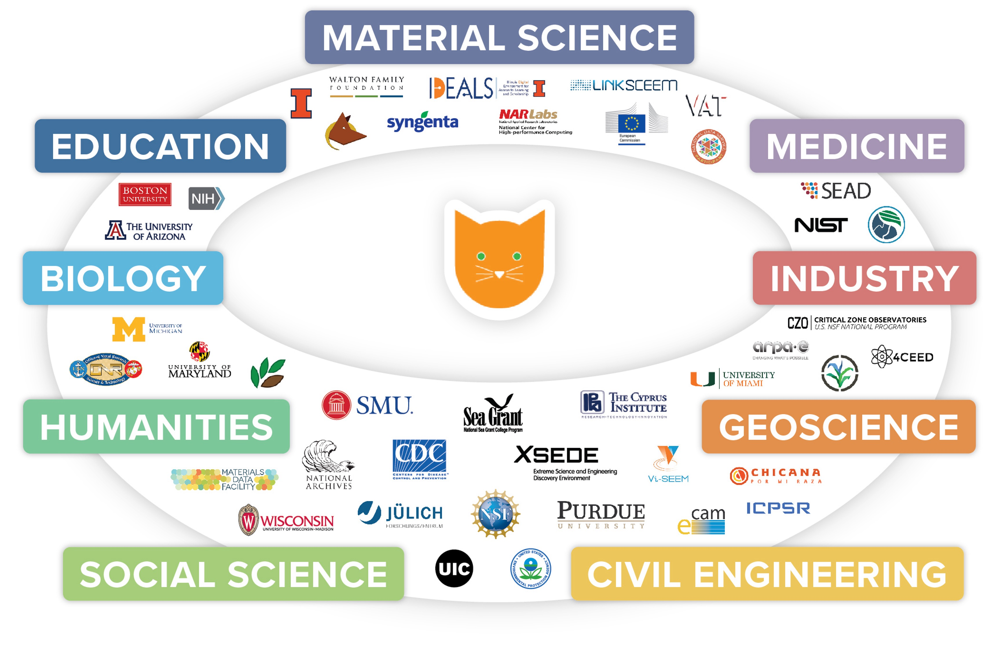

# About Clowder

[Clowder](https://clowderframework.org/) is a cloud native data management framework to support any research domain. Clowder was developed to help
researchers and scientists in data intensive domains manage raw data, complex metadata, and automatic data pipelines.
Clowder is not a central system, but software that research labs and individual users can install on local clusters or
in the cloud. Clowder is data agnostic, but can be customized for specific data types through a sophisticated
information extraction bus and web based visualization plugins. Clowder is also a community of practitioners working
on data intensive research projects and developing tools that work across research domains.

<figure markdown="span">
  
  <figcaption>Supporting long tail data</figcaption>
</figure>

The first version of Clowder [v1](https://github.com/clowder-framework/clowder>) has been in development for over ten years and is currently being used in a variety
of `use cases <https://clowderframework.org/projects.html>`_. A new version of Clowder [v2](https://github.com/clowder-framework/clowder2) is currently in development. v2 builds on lessons learned from current and
prior use cases and is being developed with two major goals in mind: 1) a modernized web interface for end users 2) an
accessible and easy to maintain code base for contributors.

We are always looking for new collaborators, contributors, and ideas in the space of research data management. If you
are interested in contributing to Clowder v2 please come say hi in [Slack](https://join.slack.com/t/clowder-software/shared_invite/enQtMzQzOTg0Nzk3OTUzLTYwZDlkZDI0NGI4YmI0ZjE5MTZiYmZhZTIyNWE1YzM0NWMwMzIxODNhZTA1Y2E3MTQzOTg1YThiNzkwOWQwYWE). If you are ready to dive into the code, take
a look at [first time issues](https://github.com/clowder-framework/clowder2/issues?q=is%3Aopen+is%3Aissue+label%3A%22good+first+issue%22) in v2.
