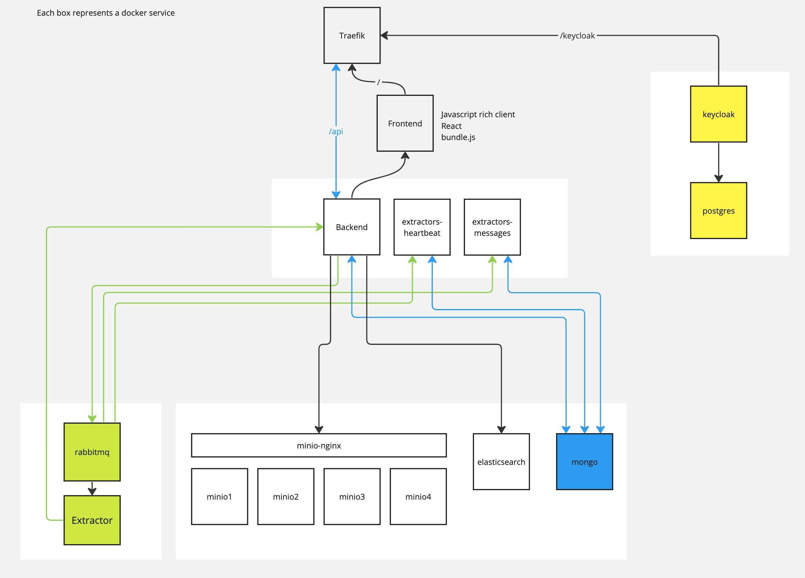

# Architecture

Clowder v2 follows the architecture of v1, we the additional split of the server side into
multiple standalone containers.
Each box below is a docker service as defined in `docker-compose.yml`.
Boxes are grouped logically into backend, keycloak, extractors, database boxes.
Lines show interactions between containers over the docker network.

<figure markdown="span">
  
  <figcaption>Architecture</figcaption>
</figure>
I want to `slkdfjslkdjf` include a

- alkdjflskjdf
- alskdjflksajfd
  - [slkjdf](http://clowder.com)
  -
