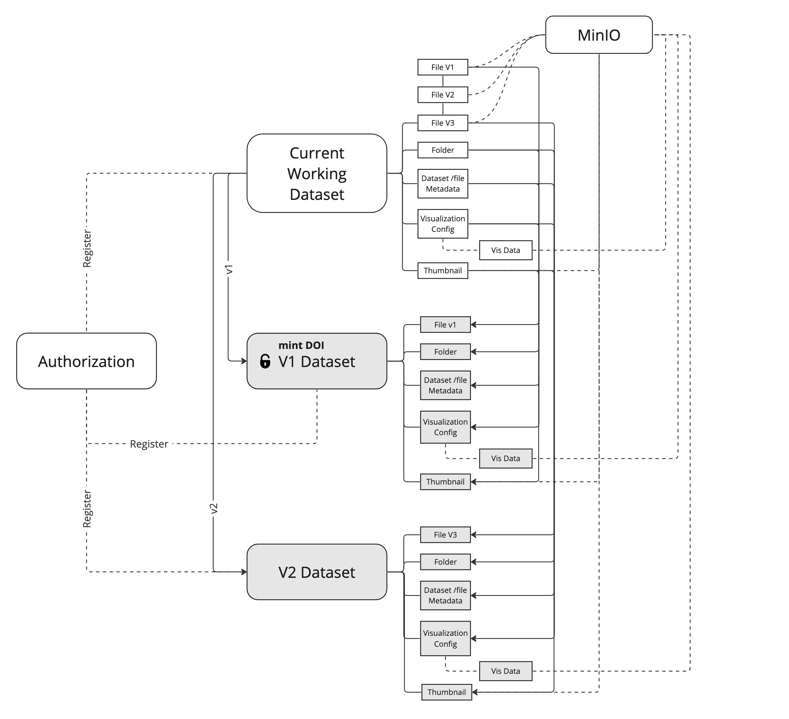
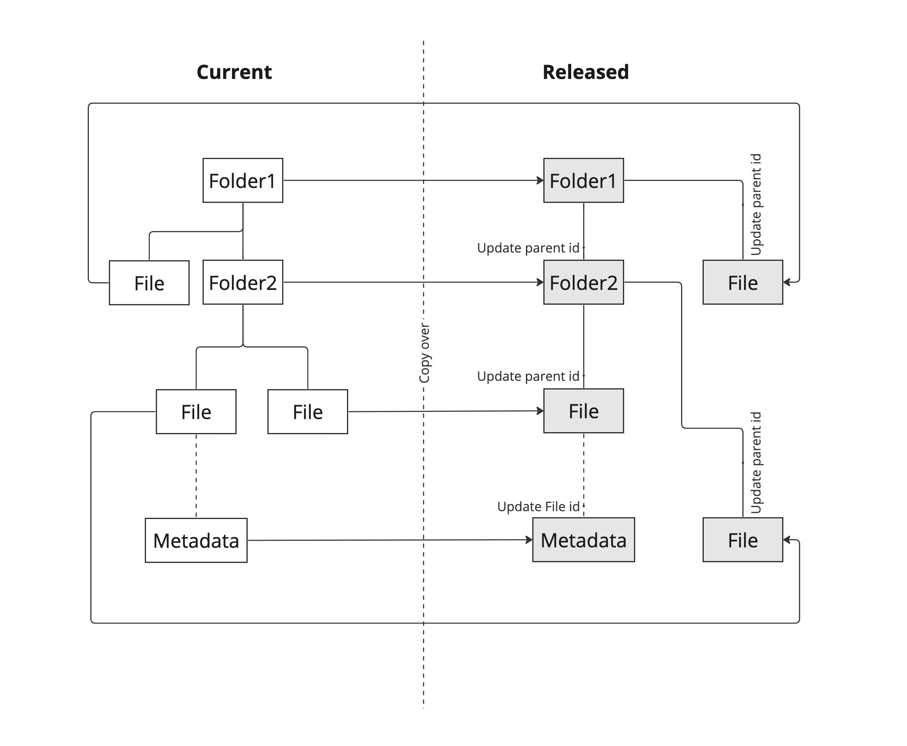
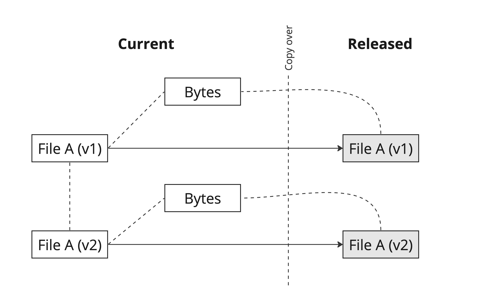

# Dataset Versioning Design Documentation

## Overview

The dataset versioning feature in Clowder is designed to enhance data management by allowing users to release datasets,
track changes, and maintain a history of modifications. Additionally, it prepares Clowder for minting Digital Object
Identifiers (DOIs) for any given dataset version, ensuring unique and persistent identification.

## Objectives

- **Track Changes**: Efficiently record changes to datasets.
- **Maintain History**: Provide a complete history of modifications.
- **Version Management**: Enable users to navigate between different versions of a dataset.
- **Ensure Data Integrity**: Modifications on a released version are forbidden, ensuring the integrity of released
  datasets.

## Architecture

The architecture diagram illustrates Clowder’s dataset versioning. The *Latest Dataset* is actively modified,
including its files, folders, metadata, visualizations, and thumbnails. Changes are continuously updated to reflect the
latest state.

Users can decide to release the latest state of the latest dataset at any given time. When a dataset is
released, it becomes a *Versioned Dataset*. Any versioned dataset, such as V1 Dataset, can be assigned a Digital Object
Identifier (DOI) for unique identification. Once a DOI is assigned, this version cannot be deleted.

The releasing process duplicates the current dataset state, including preserving files, folders, metadata,
visualizations, and thumbnails in their current form. An additional identifier, `origin_id`, is used to link the
current dataset with the released version. The `frozen_version_num` is an incremental integer that indicates the
version number of the released dataset.



The following diagram illustrates the process of copying a dataset's folder/file structure from its current state to a
released state in Clowder. During this transition, all folders, files, and metadata are duplicated; each entity updates
its parent ID recursively to reflect the new structure, ensuring a consistent hierarchy in the released dataset.



The diagram details how files are duplicated in association with a versioned dataset. Each file document in MongoDB is
copied into the released collection, with the origin ID linking back to the same underlying data bytes.


## Database Changes

### 1. New Collections

We refer to the original dataset as the latest dataset. Additionally, we introduce new collections to store
the released dataset information. The new collections include:

- **datasets_freeze**: Released dataset documents will be copied over to store released dataset information.
- **files_freeze**: Files associated with the released dataset.
- **folders_freeze**: Folders.
- **metadata_freeze**: Metadata.
- **visualizations_config_freeze**: Configuration of visualizations.
- **visualizations_data_freeze**: Visualization data.
- **thumbnails_freeze**: Thumbnails.

### 2. Data Models

- **Dataset Model**: Each released dataset version will contain additional fields including:
    - `frozen`: Boolean indicating if the dataset is released. _False indicates the latest dataset._
    - `frozen_version_num`: Incremental integer indicating the version number. _-999 indicates the latest dataset._
    - `origin_id`: Reference to the original resource. If it's the latest version, it will be the same as the current
      dataset ID.
- **File, Folder, Metadata, Visualization, and Thumbnail Models**:
    - `frozen`: Boolean indicating if the resource is released.
    - `origin_id`: Reference to the original resource.

### 3. MongoDB Views

We use MongoDB views to join the latest dataset with the released datasets, providing a comprehensive view
for client consumption. These views include:

- **datasets_view**: Combines datasets and datasets_freeze.
- **files_view**: Combines files and files_freeze.
- **folders_view**: Combines folders and folders_freeze.
- **folders_files_view**: Combines folders, files, folders_freeze, and files_freeze for pagination and sorting use
  cases.
- **metadata_view**: Combines metadata and metadata_freeze.
- **visualization_config_view**: Combines visualization_config and visualization_config_freeze.
- **visualization_data_view**: Combines visualization_data and visualization_data_freeze.
- **thumbnail_view**: Combines thumbnails and thumbnails_freeze.

## API Changes

### New Endpoints

- **Freeze Dataset**: Endpoint to release a dataset.
    - **POST** `/datasets/{dataset_id}/freeze`
    - Action: Copies dataset and associated entities to frozen collections, sets `frozen` flag.

- **List Frozen Datasets**: Endpoint to list all released versions associated with a dataset.
    - **GET** `/datasets/{dataset_id}/freeze`

- **Get Specific Version**: Endpoint to retrieve a specific version of a dataset.
    - **GET** `/datasets/{dataset_id}/freeze/{frozen_version_num}`

- **Get the Latest Version**: Endpoint to retrieve the latest version of a dataset.
    - **GET** `/datasets/{dataset_id}/freeze/latest_version_num`

- **Delete Specific Version**: Endpoint to delete a specific version of a dataset.
    - **DELETE** `/datasets/{dataset_id}/freeze/{frozen_version_num}`
    - The procedure for deleting a released dataset version is as follows:
        1. Delete associated metadata (Mongo document).
        2. Delete folders (Mongo document).
        3. Delete dataset thumbnail (Mongo document and raw bytes only if raw bytes not used in other released versions
           or the latest dataset. _* Referred to as "if applicable" from now on_).
        4. Delete dataset visualization configuration (Mongo document).
        5. Delete dataset visualization data (Mongo document and raw bytes if applicable).
        6. Delete files:
            - Delete file metadata (Mongo document).
            - Delete file thumbnail (Mongo document and raw bytes if applicable).
            - Delete file visualization configuration (Mongo document).
            - Delete file visualization data (Mongo document and raw bytes if applicable).
            - Delete file (Mongo document and raw bytes if applicable).
        7. **Mark released dataset as deleted (Mongo document).**

## User Interface

- **Release Dataset**: Add an option to release a dataset.
- **Dataset Version History**: Implement a feature to list all dataset versions using
  collapsible, sections, links, and include pagination to enhance navigation and user experience
    - **Version Navigation**: Allow users to navigate between different versions of a dataset. Associated files,
      folders,
      metadata, visualizations, and thumbnails will be displayed accordingly.
    - **Delete Version**: Develop functionality to delete a specific dataset version or the current dataset,
    - providing users with greater control over dataset management
- **Forbidden Modifications**: Prevent modifications to a released dataset.

## Digital Object Identifier (DOI) Integration
Currently, the feature to generate DOI through [DataCite](https://datacite.org/) is integrated with Clowder. The user is provided this option
when they release a dataset. Clowder then talks with the DataCite API to mint a DOI for the released dataset and
submits some metadata about the dataset like its title, URL, and creator details. The generated DOI is displayed in the
dataset page in the Details section.

### DOI Configuration Details
The following configuration changes need to be made to integrate DOI generation with Clowder using DataCite:

In the backend module, the following configurations should be set:
```python
DOI_ENABLED = True # Enable or disable DOI generation
DATACITE_API_URL = "https://api.test.datacite.org/" # DataCite API URL (production URL is https://api.datacite.org/)
```

Also, following environment variables should be set when running the backend module:
```shell
DATACITE_USERNAME="<DataCite repository username>"
DATACITE_PASSWORD="<DataCite repository password>"
DATACITE_PREFIX="<DataCite repository prefix>"
```

In the frontend module, the following configuration should be set:
```javascript
config["enableDOI"] = true; // Enable or disable DOI generation
```

## Future Enhancements
- **Add support for CrossRef when generate DOI**: Currently, Clowder supports DataCite for minting DOIs. We might need to
  integrate CrossRef to provide users with more options, as some users may already have an account with CrossRef.
