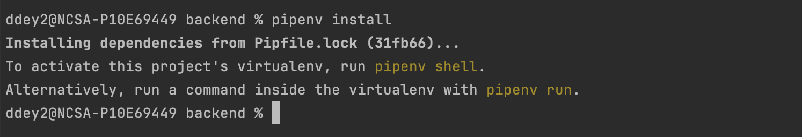

# Clowder V2 Dev Environment Setup

## 1. Explore Github Repository

### 1.1 Prerequisites

- Understanding how git works
    - For more information, read this [https://www.atlassian.com/git](https://www.atlassian.com/git)

- Create a GitHub Account
    - If you do not have a GitHub account, create one [https://github.com/signup](https://github.com/signup)

### 1.2 GitHub Basics

- **Repositories** are centralized locations for project files.

- **Issues** are used to track tasks, bugs, and feature requests.

- **Pull** **Requests** **(PRs)**: Proposed changes to a repository.

### 1.3 Creating Issues in Clowder2

- Navigate to the Clowder2 repository:
  [https://github.com/clowder-framework/clowder2/](https://github.com/clowder-framework/clowder2/)

- Click on the \"Issues\" tab.

- Click the \"New issue\" button.

- Fill in the issue template with a descriptive title and detailed
  description.

- Click \"Submit new issue.\"

- Optional: Decide assignees and pick appropriate labels

### 1.4 Creating a Branch Related to an Issue Using GitHub Interface

- Click on the \"Issues\" tab and open the issue for which you want to
  create a branch.

- On the issue page, under development section on the right side
  panel, click the \"Create a branch\" link

- In the pop up window, double check if it is the correct repository
  destination "clowder-framework/clowder2". In rare case, you can
  create a branch in another clowder affiliated repository

- The default branch will be created based on the "main" branch, but
  you can change branch source if you would like to branch off a
  specific branch.

- Once you click the "Create branch" button, a new branch will be
  created with a name referencing the issue number.

### 1.5 Opening a Pull Request (PR) or Draft PR

- Make your code changes and commit them.

    - Using the command line tool, run `git commit -m "<your-commit-message>"`
    - **Alternatively, you can use PyCharm to commit, which will be covered in the next section.**

- Push the branch to GitHub

    - If using the command line, run `git push origin <branch-name>`
    - **Alternatively, you can use PyCharm to push, which will be covered in the next section.**

- Navigate to the repository on GitHub. Alternatively, use the link
  provided in the command line after you push your branch.

- Find the \"Pull requests\" tab, then click the \"New pull request\"
  button.

- Select the correct base branch (the branch to be merged into) and
  your branch. Review the changes, and if everything looks correct,
  click the \"Create pull request\" button.

- Fill in the PR template with a descriptive title and detailed
  description of the changes.

- Appoint reviewers.

- Select \"Create draft pull request\" if your work is not yet
  complete; otherwise, click \"Create pull request.\"

### 1.6 Review Process

- Once the PR is created, assign other developers for peer review. The
  PR will also require review from the project maintainers.

- Reviewers should provide feedback and/or approve the changes.
  Navigate to the "Files changed" tab and click "Review changes"
  button to provide feedback/

- To provide inline feedback, click on the lines directly.

- The PR author needs to address any feedback by making changes and
  pushing them to the branch.

- Click \"Resolve conversation\" to indicate that the feedback has
  been addressed.

- Once approved, AND all the github actions (checks) passed, the PR
  can be merged into the main branch.

- If there are multiple commits, consider using the \"Squash and
  merge\" option.

## 2. Set up Integrated Development Environment (IDE) (PyCharm)

### 2.1 Download PyCharm

- Download PyCharm Community Edition
  ([https://www.jetbrains.com/pycharm/download/](https://www.jetbrains.com/pycharm/download/)).
  It should select the right PyCharm version for your computer.

- Installing PyCharm community edition.

- **If you have access to Professional Edition**, feel free to use
  that since it has more comprehensive features

### 2.2 Opening the Clowder2 Project in PyCharm

- Clone the Clowder2 GitHub repository project via command line
  (terminal).

    - On the command line, make sure that you have git installed.

    - Note that on the GitHub page, there is a button 'Code.' Click on
      that and you will be able to copy the HTTPS link to the Clowder2
      GitHub repository.

    - The command for cloning is: `git clone https://github.com/clowder-framework/clowder2.git`

- Once cloned, you can click on the 'Open' after you open PyCharm, and
  navigate to the folder where Clowder2 was cloned and open the
  project.

Alternatively

- After you open PyCharm, click on "**Get from VCS**" button

- Select "**Git**" as the version control option and put in the Clowder's GitHub repository URL

- Choose a Directory path which is empty

- Click "Clone"

### 2.3 Switching to a Branch

Within PyCharm, under Git \> Branches you have the option of either
creating a branch from the one you are on, or from checking out remote
branches.

### 2.4 Comparing Files Across Branches

PyCharm also allows you to compare files across branches. Click on
"**Git**" and then "**Current File**" and you can use **"Compare with
Branch..."** to compare file changes with other branches. "**Fetch**"
will fetch all remote branches. If you are unable to check out a new
branch, make sure you run fetch first to bring you up to date with the
latest changes in the GitHub repository. Also take note of the option
**"Merge...".** Periodically, you may need to merge the *main* branch
onto your local development branch to bring the changes that may have
got merged on the *main* branch.

### 2.5 Commit and Push

Below we see options called **"Commit..."** and **"Push..."**. You
should commit and push your work often (at least daily or after you've
made significant changes) to make sure that your changes are saved and
will not be lost. The commits you make will be visible on GitHub, and
that way other people can test your branch.

## 3. Install Libraries

For our project, we have two main parts: the backend and the frontend.

- **Backend:** We use Python and a framework called
  [FastAPI](https://fastapi.tiangolo.com/), which helps
  us create the backend of our application. To run our backend
  efficiently, we use the
  [Uvicorn](https://www.uvicorn.org/) server. To manage
  and install all the necessary tools and libraries for the backend,
  we use a package manager
  [Pipenv](https://pipenv.pypa.io/en/latest/).

- **Frontend:** We use [React](https://react.dev/), a
  popular library for building user interfaces, to create the frontend
  of our application. The frontend module is developed using
  TypeScript, React, Material UI, Redux, webpack, Node.js. To manage
  and install all the tools and libraries needed for the frontend, we
  use a package manager called
  [NPM](https://www.npmjs.com/) (Node Package Manager).

### 3.1 Install Backend Dependencies

#### 3.1.1 Python

Install Python [here](https://www.python.org/downloads/). Download the specific architecture version. We recommend
using Python 3.9

Open the downloaded file and follow the installation instructions. After
the installation, open a terminal or command prompt.

Type `python --version` to check that Python is installed and to see the
version number.

#### 3.1.2 Install Pipenv

`pip install --user pipenv`

Pipenv provides a single, unified interface that allows you to manage
your Python project dependencies and virtual environments with ease.

- It uses a **Pipfile** to specify the packages you need and a
  **Pipfile.lock** to lock down the exact versions of these packages
  to ensure reproducibility.

- It automatically creates and manages a **virtual environment** for
  your projects, ensuring that your dependencies are isolated from
  other projects on your mac

We have 2 Pipfiles

- [clowder2/Pipfile](https://github.com/clowder-framework/clowder2/blob/main/Pipfile) -
  contains the libraries needed for overall app

- [clowder2/backend/Pipfile](https://github.com/clowder-framework/clowder2/blob/main/backend/Pipfile) -
  contains all libraries specific to backend

#### 3.1.3 Install libraries using pipenv

Below are the steps to set up **backend specific libraries**:

In the PyCharm Terminal you could try below commands to install
dependencies for Clowder v2:

1. `cd backend` → setup backend environment

2. `pipenv install` → installs all dependencies

3. `pipenv install --dev` → installs all dev dependencies

4. `pipenv uninstall <package_name>` → uninstalls the particular
   dependency

5. `pipenv uninstall ---all` → uninstalls all dependencies

6. To add/update the dependencies version, make sure to update
   **Pipfile** and run pipenv install

7. For a clean restart, delete **Pipfile.lock** file and run pipenv
   install

#### 3.1.4 Connect virtual environment in PyCharm

Go to File \> Settings (or PyCharm \> Settings on macOS) \> Project \> Python Interpreter
>

"Add Interpreter" → "Add Local Interpreter..."

Pick Virtualenv Environment → Pick Existing → **Click the ...**

Find the virtual environment python path.

E.g. My virtual environment python path lives at:

*/Users/cwang138/.virtualenvs/backend-vtWdOmS7/bin/python*

### 3.2 Install Frontend Dependencies

#### 3.2.1 Install Node (and Npm).

Download
[https://nodejs.org/en/download/package-manager](https://nodejs.org/en/download/package-manager)

We recommend using Node v16.15 LTS.

#### 3.2.2 Npm install dependencies

[npm](https://www.npmjs.com/) stands for Node Package
Manager. It\'s a package manager for JavaScript, and it\'s the default
package manager for the Node.js runtime environment. It helps developers
manage and share reusable code packages (modules), making it easier to
install, remove libraries and dependencies in your projects.

The libraries and dependencies are specified in **package.json** and the
exact versions are locked down using **package_lock.json.** In addition
to libraries, you can define scripts under the "script" field in
package.json.

Here are the links to
[clowder2/frontend/package.json](https://github.com/clowder-framework/clowder2/blob/main/frontend/package.json)
and
[clowder2/frontend/package-lock.json](https://github.com/clowder-framework/clowder2/blob/main/frontend/package-lock.json)

Useful commands to install the dependencies for Clowder frontend :

1. `npm install` → installs all dependencies

2. `npm install <package_name>` → install specific dependency

3. `npm uninstall <package_name>` → uninstalls the particular dependency

4. `npm uninstall` → uninstalls all dependencies

5. To add/update the dependencies version, **make sure to update
   package.json, and run npm install**

6. For a clean restart, delete package-lock.json and node-modules, and
   run npm install

7. npm run codegen:v2:dev → run this whenever you make any changes in
   backend classes/functions and that needs to be reflected in frontend
   classes/functions

> 

## 4. Set up Docker

[**Docker**](http://docker.com) is a platform that allows you to package
applications and their dependencies into portable, isolated units called
containers.

- A docker image is like a blueprint for a container, containing the
  application code, libraries, and environment settings needed to run
  the application.

- A docker container is the running instance of a Docker image,
  providing an isolated environment where the application runs.

### 4.1 Installing Docker

- You will need to install docker first, this can be done by following
  the instructions at:

    - [Install Docker Desktop on Mac](https://docs.docker.com/desktop/install/mac-install/)

    - [Install Docker Desktop on Windows](https://docs.docker.com/desktop/install/windows-install/)

> If the docker desktop shows "Docker Desktop stopped....", you might
> have to install wsl (windows subsystem linux). This is done using: wsl
> --install --distribution ubuntu

- [Install Docker Desktop on
  Linux](https://docs.docker.com/desktop/install/linux-install/)

- Once you have installed docker, please see below to test it to make
  sure it works as expected.

#### *4.1.1 Troubleshooting Docker on Windows (Skip if not applicable)*

*When installing Docker for Windows, please make sure that you have all
updates installed. When running any of the docker commands, I\'d
recommend using the powershell (no need for administrator). Main reason
is that I will use it to get the current working directory, under the
MS-DOS command you will need to use instead.*

*1. install wsl from powershell with Admin rights: wsl --install and
reboot your system this will install ubuntu as well after the reboot\
this can be removed using wsl --unregister ubuntu*

*2. update wsl `wsl -update` and restart wsl `wsl --shutdown`*

*3. check your version `wsl --status`*

#### 4.1.2 Testing Docker Installation

To test your installation you should be able to use the following from
the command line:

docker run docker/whalesay cowsay Hello World

This should generate the following output:

#### 4.1.3 Useful Docker Command Line

The docker application takes a second argument that is indicates what to
do:

- `docker run` → creates a container from an image and starts the
  default application in the container. The run command takes
  additional flags, please look
  [here](https://docs.docker.com/reference/cli/docker/container/run/)
  for details..

- `docker images` → are what is used to start a container, these are
  pulled from a server and contain everything needed to run the application (think a zip file of a linux
  filesystem).

- `ls` : shows a list of all images you have downloaded.

- `rm` : will remove an image (you can always download it again).

- `docker pull` → will download an image without running it, this is
  also used to make sure you have the latest image downloaded.

- `docker logs` → shows the output from a container, you can do this
  after the container is finished, or if the container runs in the
  background allows you to see the output of the container (think of
  the tail command in unix).

- `docker rm` → removes a stopped container, this is a cleanup process.
  You will free up the disk space that the stopped container takes up.

- `docker stop` → stops a container that is running.

### 4.2 Docker Compose Explained

[Docker Compose](https://docs.docker.com/compose/) is a
tool for defining and running multi-container applications. It is the
key to unlocking a streamlined and efficient development and deployment
experience. A
[docker-compose.yam](https://github.com/clowder-framework/clowder2/blob/main/docker-compose.yml)l
file is used to define and manage multi-container Docker applications as
a single service. This file is mainly for production.

#### 4.2.1 For Development

We have a separate
[docker-compose.dev.yml](https://github.com/clowder-framework/clowder2/blob/main/docker-compose.dev.yml)
where we have separated the backend and frontend from the other docker
containers. We run the backend and frontend separately in PyCharm to
make the development process easy.

#### 4.2.2 Run Clowder Docker Containers

1. `docker-compose -f <docker-compose.dev.yml> -p <clowder2-dev> up
   -d --build` → create and build all the containers

2. `docker-compose -f <docker-compose.dev.yml> -p <clowder2-dev> down` → stops all containers

**We have a
[script](https://github.com/clowder-framework/clowder2/blob/main/docker-dev.sh)
to make it easier:**

**`./docker-dev.sh up` → internally runs the above command 1**

**`./docker-dev.sh down` →internally runs the above command 2**

### 4.3 View Containers in Docker Desktop

### *4.4 Delete Storage and Restart (Optional)*

- *If you ever need to delete all the storage data for the containers,
  please delete all the respective volumes in the docker desktops (see
  screenshots).*

- *Alternatively, you can use the command line to run `docker-compose
  -f <docker-compose.dev.yml> -p <clowder2-dev> down -v`*

- *After volumes have been successfully removed, run the docker
  compose up command to start over.*

## 5. Run/Debug Clowder2 Full Stack

By following these steps, you can start both the frontend and backend,
along with the necessary Docker containers, and run the Clowder 2 stacks
using PyCharm.

### 5.1 Start Docker Dependencies

Ensure that the necessary dependencies are running. This includes
**Elasticsearch, MongoDB, RabbitMQ, extractor heartbeat listeners,
and/or extractors**. Use the following command to start them

`sh docker-dev.sh up`

(Details please refer to previous section: [Run Clowder Docker
Containers](#run-clowder-docker-containers))

Verify that the dependencies are running by running: `docker ps`

### 5.2 Run Clowder 2 Backend

In PyCharm, navigate to the left panel where you will see the "Run"
menu (located between "Refactor" and "Tools"). This menu contains
all the configurations needed to run Clowder.

**Select and Run Configuration:** On the right side of the PyCharm
interface, you will see the name of your selected run configuration.
Next to it, there are buttons for running the configuration. Ensure that
uvicorn is selected. The run button is represented by an arrow.

To run the backend, choose **'uvicorn'** under the run/debug
configurations and choose run.

### 5.3 Run Clowder 2 Frontend

To run the front end, run the **'npm start:dev'** configuration. **After
that, Clowder2 should open up at localhost:3000 in your browser.\
**

### 5.4 Debugging using PyCharm

#### 5.4.1 Debugging the Backend

- Debugging the backend is almost the same as running. Simply choose
  **debug** instead of run. **Set breakpoints** somewhere in the
  backend code and PyCharm will stop at those breakpoints.

#### 5.4.2 Debugging the Frontend

- Make sure you have a running backend first

- Make sure to run the frontend as instructed in the above section.

- Additionally, set up "**Javascript Debug**" and run in "**Debug**"
  mode

- **This will open a new browser window.** In order to debug the front
  end, you must use **the new browser** window that opens up. The
  original one opened by the usual run config will not have any
  effect. Then you can put breakpoints in the front end and will stop
  when they are reached.

Here is a screenshot of what you would see in the backend debug mode
when a breakpoint is reached. You can see the method that we are in
along with the values.

Here\'s a look at what you would see when debugging the frontend
JavaScript. In this example, we\'re examining the \`**useEffect**\`
method within the main thread. The debugger shows the current
\`**datasetId**\` and \`**folderId**\`.

## 6. Pre-commits

Pre-commit hooks are used to identify and fix simple code issues before
submission to code review, allowing reviewers to focus on more
significant architectural changes. Clowder2 pre-commit hooks include
below automatic formatting and checks:

- Python style checks and formatting using **black, isort, and
  flake8**.

- Custom script to create openapi.json file from the backend FastAPI
  app.

- Eslint and prettier for frontend code.

### 6.1 Install Pre-commit Hooks

- Run pip install pre-commit to install pre-commit.

- Navigate to the **root directory of the repository** and run
  pre-commit install to install the pre-commit hooks.

### 6.2 Automatic Hook Execution

- The hooks will run automatically on every commit.

- If any of the hooks fail, the commit will be aborted.

- Hooks are stored in the .git/hooks directory and will be in place
  for all future commits and branches.

### 6.3 Manual Hook Execution

- To run the hooks manually, use `pre-commit run --all-files` in the
  command line. You should see a list of checks. If any fail, please
  investigate the issues and fix them accordingly.

### 6.4 Skipping Hooks (Not recommended)

- To skip the hooks, use `git commit --no-verify` or in PyCharm, click
  on the cog icon in the PyCharm commit interface and uncheck \"Run
  Git hooks\".

## 7. Optional

### 7.1 Visual Studio Code (VS Code)

Feel free to use Visual Studio Code if you're already familiar with it.
Like Pycharm, VS Code is a free, lightweight, and powerful code editor.
It supports a wide range of programming languages and comes with
features like syntax highlighting, debugging, version control
integration, and extensions to enhance functionality. If you haven\'t
already, download and install Visual Studio Code from the [official
website](https://code.visualstudio.com/).

### 7.2 Setup Github CoPilot with VS Code

If you have [Github
CoPilot](https://github.com/features/copilot/), you can
integrate it with VS Code and it can help you generate a lot of the
coding.

#### 7.2.1 Step 1: Install GitHub Copilot Extension

- Open VS Code.

- Go to Extensions View:

    - Click on the Extensions icon in the Activity Bar on the side of
      the window, or press Ctrl+Shift+X (Windows/Linux) or Cmd+Shift+X
      (macOS).

> 

- Search for GitHub Copilot:

    - In the search bar, type GitHub Copilot.

- Install the Extension:

    - Click on the Install button next to the GitHub Copilot
      extension.

#### 7.2.2 Step 2: Sign in to GitHub

1. Open Command Palette:

- Press Ctrl+Shift+P (Windows/Linux) or Cmd+Shift+P (macOS) to open
  the Command Palette.

2. Sign In:

- Type GitHub: Sign in and select the option.

- Follow the prompts to sign in with your GitHub account.

#### 7.2.3 Step 3: Enable GitHub Copilot

1. Open Command Palette:

    - Press Ctrl+Shift+P (Windows/Linux) or Cmd+Shift+P (macOS).

2. Enable Copilot:

    - Type GitHub Copilot: Enable and select the option.

#### 7.2.4 Step 4: Start Using GitHub Copilot

- Open a file: Open a file in a supported language (e.g., Python,
  JavaScript).

- Begin typing: As you type, GitHub Copilot will provide suggestions.
  You can accept suggestions by pressing Tabor Enter.

> 
>
> 
>
> 

### 7.3 Browser inspect mode

The inspect mode gives access to a list of tools that collectively help
developers diagnose and fix issues, optimize performance, and ensure the
best user experience. Let's take Chrome for example:

#### 7.3.1 Accessing Inspect Mode

- Right-click on a webpage and select \"Inspect\" from the context
  menu.

- Alternatively, press `Ctrl+Shift+I` (Windows/Linux) or
  `Cmd+Option+I` (Mac).

#### 7.3.2 Elements Tab

- View and modify the HTML structure and CSS styles of a webpage.

- Hover over elements to see their dimensions and applied styles.

- Edit HTML or CSS directly and see changes in real-time.

#### 7.3.3 Console Tab

- Useful for debugging scripts and interacting with the page's
  JavaScript context.

#### 7.3.4 Network Tab

- Monitor network activity and inspect requests and responses.

- Filter requests by type (e.g., FETCH/XHR, JS, CSS, Images) to focus
  on specific resources.

- Click each entry to view detailed information about each request,
  such as headers, payload, and timing.
