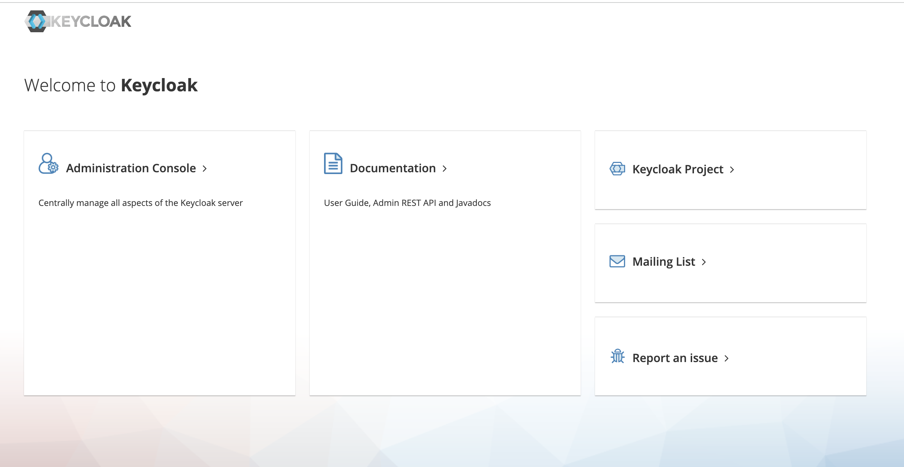
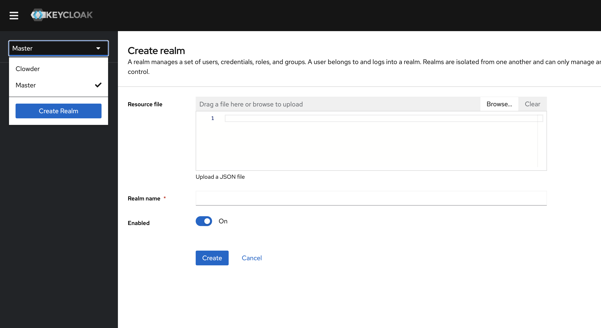
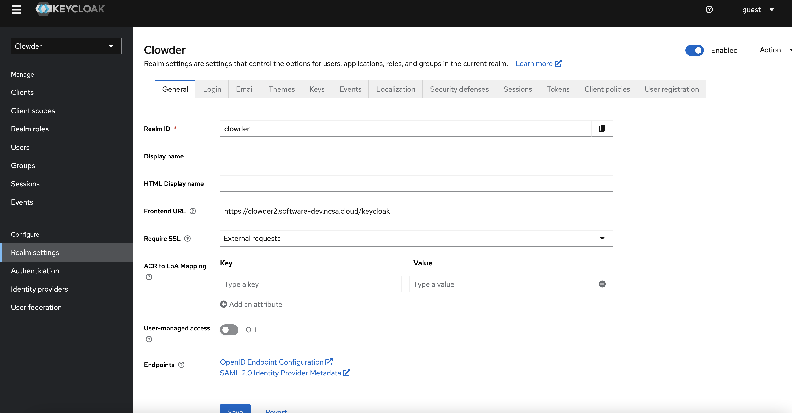
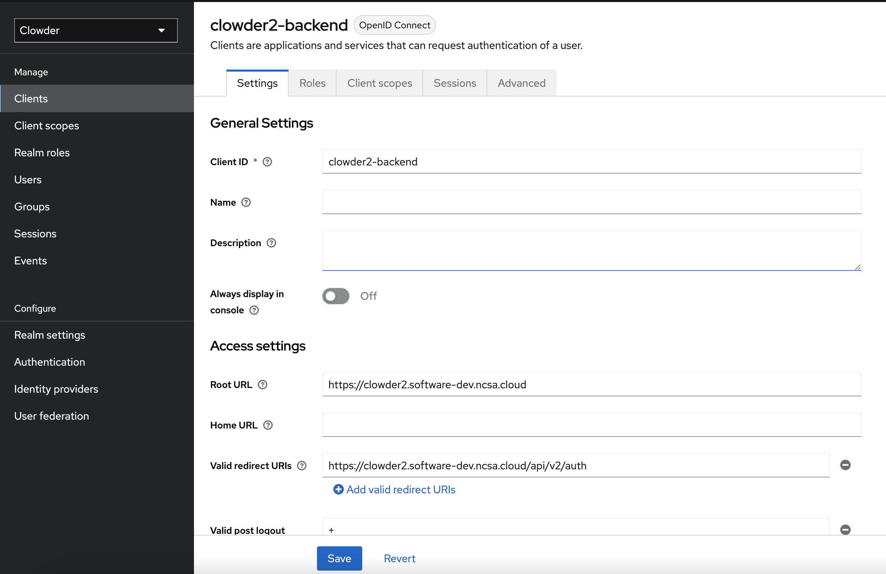

# How to configure the realm in keycloak

###  Access keycloak admin console
Once keycloak container is up running, you can access the admin console at `https://{hostname}/keycloak`.  Click
"Administration Console " to login in. If not specified, the default admin username and password are `admin`/ `admin`.


### Import Realm
The default Realm of keycloak is Master. To use the realm for this project, the easiest way is to **import
the pre-defined realm json file**. You can find some examples in the Clowder 2 repository under the path
`scripts/keycloak/`. For example, if you are running a docker-compose development stack on your local host, you can
import the file `clowder-realm-dev.json`.

To import, please navigate to the dropdown on top left corner and click **Create Realm**. Once you see the create
realm interface, you can either copy-paste the json definition into the dialog; or click **Browse** and select the
realm json file you want to use.


You can check if the Clowder realm is successfully created by whether you can see the **Clowder** in the dropdown
of top left corner. Once select Clowder there, you should also see the "Welcome to Clowder" Page. Last thing to
verify, if you navigate to the **Clients** on the sidebar, you should be able to see some custom created clients (e.
g. clowder2-backend)

### Adjust setting based on different hostname
If you are deploying the Clowder stack on VMs with its own domain name, you would need to adjust some of the
setting to reflect the domain host name. For example, if we deploy Clowder at https://clowder2.software-dev.ncsa.
cloud, there will be three places you need to adjust:
1. Under **Realm Settings**, you would need to change the **Frontend URL** to https://clowder2.software-dev.ncsa.
   cloud/keycloak. The pattern is `http(s)://{hostname}/keycloak`
   
2. Navigate to **Clients** and find the client you will be using (in our case, it's clowder2-backend). Change the
   **root URL** to `http(s)://{hostname}`, i.e. https://clowder2.software-dev.ncsa.cloud
3. Similarly, change the **Valid redirect URIs** to be `http(s)://{hostname}/api/v2/auth` which is the API endpoint
   for validation and authenticate users, i.e.
   https://clowder2.software-dev.ncsa.cloud/api/v2/auth. Valid URI pattern a browser can redirect to after a successful
   login.
   


### Alternative
Alternatively, you can directly configure the realm json file; then import the edited file as instructed above to
achieve same effects as above.

Under clients section modify the **rootUrl** and **redirectUris**

```angular2html
...
"clients": [
    {
      "clientId": "clowder2-backend",
      "rootUrl": "https://clowder2.software-dev.ncsa.cloud",
        ...
      "redirectUris": [
        "https://clowder2.software-dev.ncsa.cloud/api/v2/auth"
      ],
    ...
```

Under attributes add/modify the **frontendUrl**
```angular2html
"attributes": {
    ...
    "frontendUrl": "https://clowder2.software-dev.ncsa.cloud/keycloak",
  }
```

A few other settings:

To enable password reset add below:
```angular2html
  "resetPasswordAllowed": true,
```

To enable email sending from keycloak (e.g. in case to recover user's forgotten password) set the below:
```angular2html
"smtpServer": {
    "replyToDisplayName": "",
    "starttls": "false",
    "auth": "",
    "host": "smtp.ncsa.illinois.edu",
    "replyTo": "",
    "from": "clowder2-devnull@illinois.edu",
    "fromDisplayName": "",
    "envelopeFrom": "",
    "ssl": "false"
  },
  ...
```
