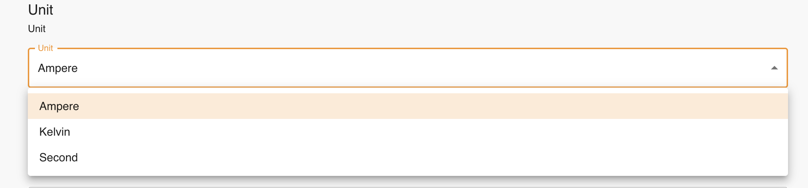
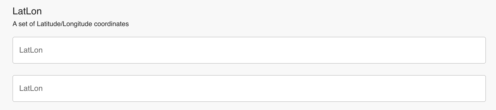

# Metadata

In Clowder 2 we decide to continue supporting both user-defined and machine-defined metadata in a flexible
representation based on [JSON-LD](https://json-ld.org/). We enforce that, to register a new metadata, either the definition
or a context URL that contains the schema of given vocabulary needs to be provided. Leveraging the
React Component, we would like to explore dynamic rendering as well as the reusability of the metadata user interface.
Our metadata definition are designed to facilitate that process.


## Structure of Metadata Definition
The structure of metadata definition looks like below:
```
{
    "name" : "Unit",
    "description" : "Unit",
    "required_for_items": {
        "datasets": false,
        "files": false
    },
    "context" : {
        "unit" : "https://schema.org/QuantitativeValue"
    },
    "fields" : [
        {
            "name" : "unit",
            "list" : false,
            "widgetType": "Select",
            "config": {
                 "type" : "enum",
                 "options": ["Ampere", "Kelvin", "Second"]
            },
            "required" : true
        }
    ]
}
```

### Widget Type
Each field corresponding to an individual widget on the frontend. `widgetType` is used to define its appearance at the
user interface. Currently, we follow the name convention of [Material UI components](https://mui.com/components/)
and we support dropdown(`Select`), input box (`TextField`), calendar (`DateTimePicker`). Here is an example of a Select
widget:



### Multiple Widgets
A metadata entry could have multiple widgets (fields). For example:
```
{
    "name" : "LatLon",
    "description" : "A set of Latitude/Longitude coordinates",
    "required_for_items": {
        "datasets": false,
        "files": false
    },
    "context" : {
        "longitude" : "https://schema.org/longitude",
        "latitude" : "https://schema.org/latitude"
    },
    "fields" : [
        {
            "name" : "longitude",
            "list" : false,
            "widgetType": "TextField",
            "config": {
                "type" : "float"
            },
            "required" : true
        },
        {
            "name" : "latitude",
            "list" : false,
            "widgetType": "TextField",
            "config": {
                "type" : "float"
            },
            "required" : true
        }
    ]
}
```
This corresponds to the Lat/Lon at the user interface:



### Configure widget
The content of config field can be flexible. It will be used to hold information that populates the frontend
appearances, as well as validate the posted values. For example:
```
   "config": {
                 "type" : "enum",
                 "options": ["Ampere", "Kelvin", "Second"]
            },
```

### List
There will also be scenarios that a widget needs the input of "undetermined number of input values". For example,
collecting as many data points on a map. The field `{"list": true}` is designed for that. For example:
```
{
    "name" : "Coordinates",
    "description" : "Any number ofof Latitude/Longitude coordinates",
    "required_for_items": {
        "datasets": false,
        "files": false
    },
    "context" : {
        "point": "https://schema.org/point"
    },
    "fields" : [
        {
            "name" : "point",
            "list" : true,
            "widgetType": "Map",
            "config": {
                "type" : "tuple"
            },
            "required" : true
        }
    ]
}
```

The correspondent metadata entry could look like:
```
{
    ...
    "context" : null,
    "context_url" : null,
    "definition" : "Coordinates",
    "contents" : {
        "point" : [(111,112), (111, 113), (113, 114), (111, 115)]
    },
    "resource" : {
        "collection" : "files",
        "resource_id" : ObjectId("62e16143e5f13ff2ff52f15d"),
        "version" : NumberInt(1)
    },
    "agent" : {
        "id" : ObjectId("62e1614ce5f13ff2ff52f18a"),
        "creator" : {
            "id" : ObjectId("62a9ed5514cd9901fa1828cf"),
            "email" : "cwang138@illinois.edu",
            "first_name" : "Chen",
            "last_name" : "Wang"
        },
        "extractor" : null
    },
    "created" : ISODate("2022-07-27T16:01:16.252+0000"),
    ...
}
```
