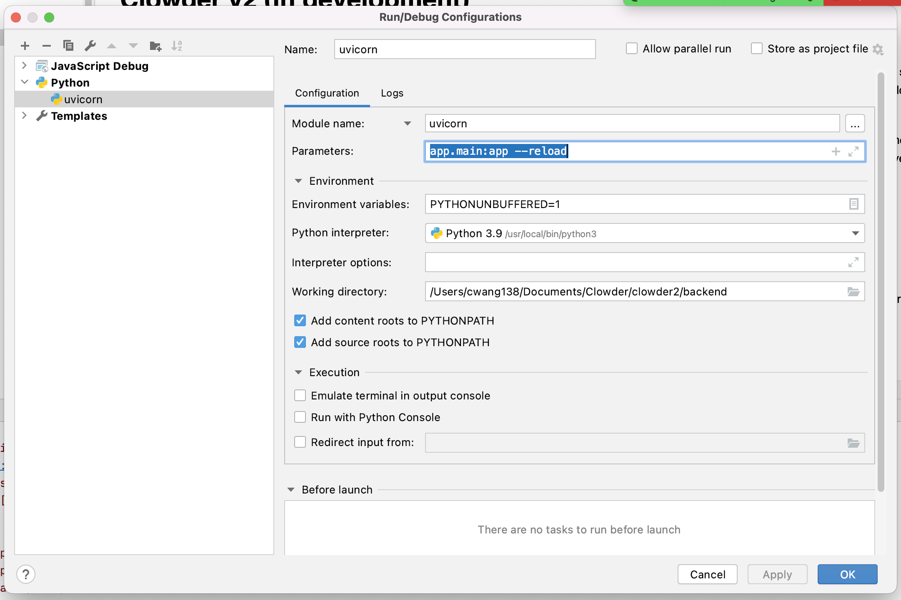
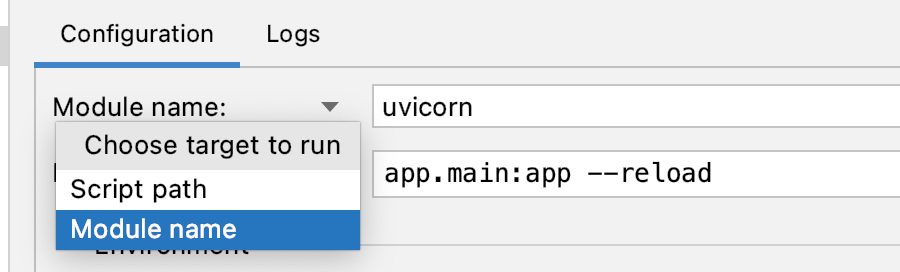
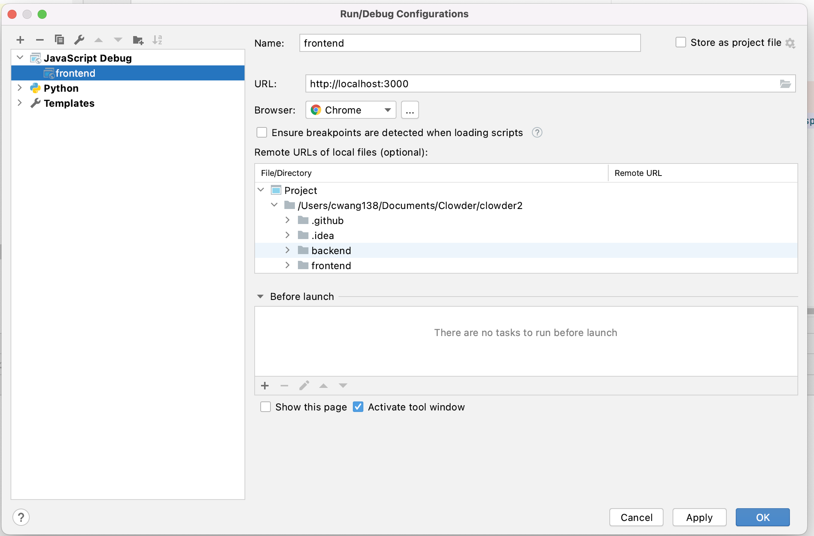

# Pycharm Setup

From the main menu select Run -> Edit Configurations...

Click on '+' to add a 'Python' configuration, and name it 'uvicorn'

Select 'Module name" and use: 'uvicorn'

With parameters: 'app.main:app --reload'

Click '+' again and add a 'JavaScript Debug' configuraion, and name it 'frontend'

With URL: 'http://localhost:3000'

and I chose 'Chrome' browser
