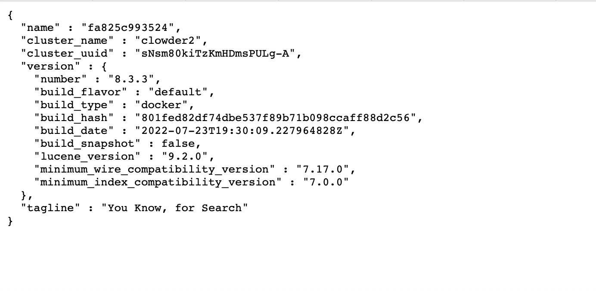

# Elasticsearch Integration Notes

For a brief introduction to elasticsearch, please refer to https://www.elastic.co/guide/en/app-search/current/getting-started.html

For some examples in python, please refer to to https://www.elastic.co/guide/en/elasticsearch/client/python-api/master/examples.html

We are running elasticsearch inside docker at port 9200. Once the elasticsearch docker container is up and running,
you should be able to connect to http://localhost:9200 and see something like below

If you see error in elasticsearch docker container and that is related to heap memory, try upgrading memory to
8Gb in docker setting.

For all the implemented elasticsearch APIs, please refere to the code in backend/app/elasticsearch/connect.py

## Common Commands

* List indices: `http://localhost:9200/_cat/indices`
* Delete index: `curl -X DELETE http://localhost:9200/{index name}`
