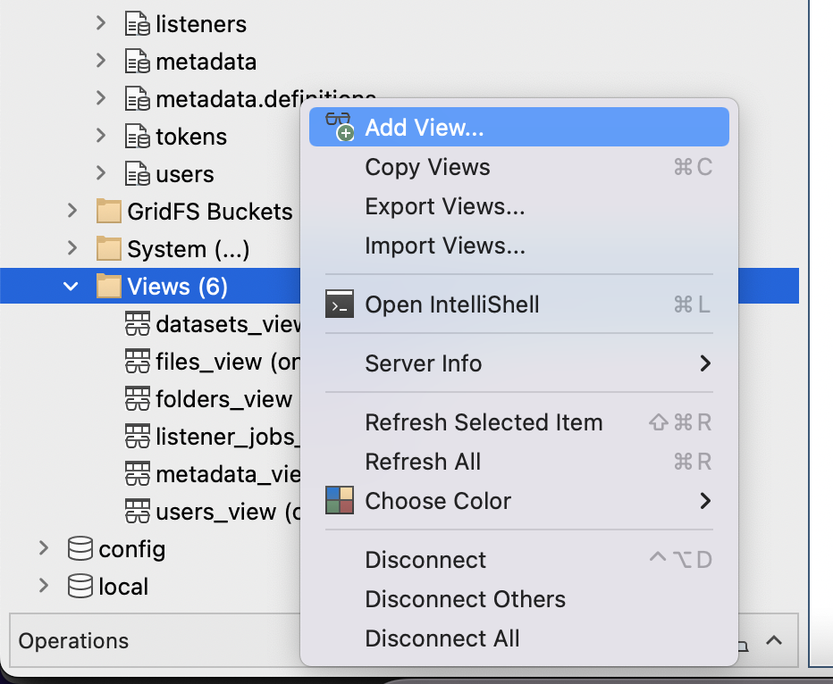
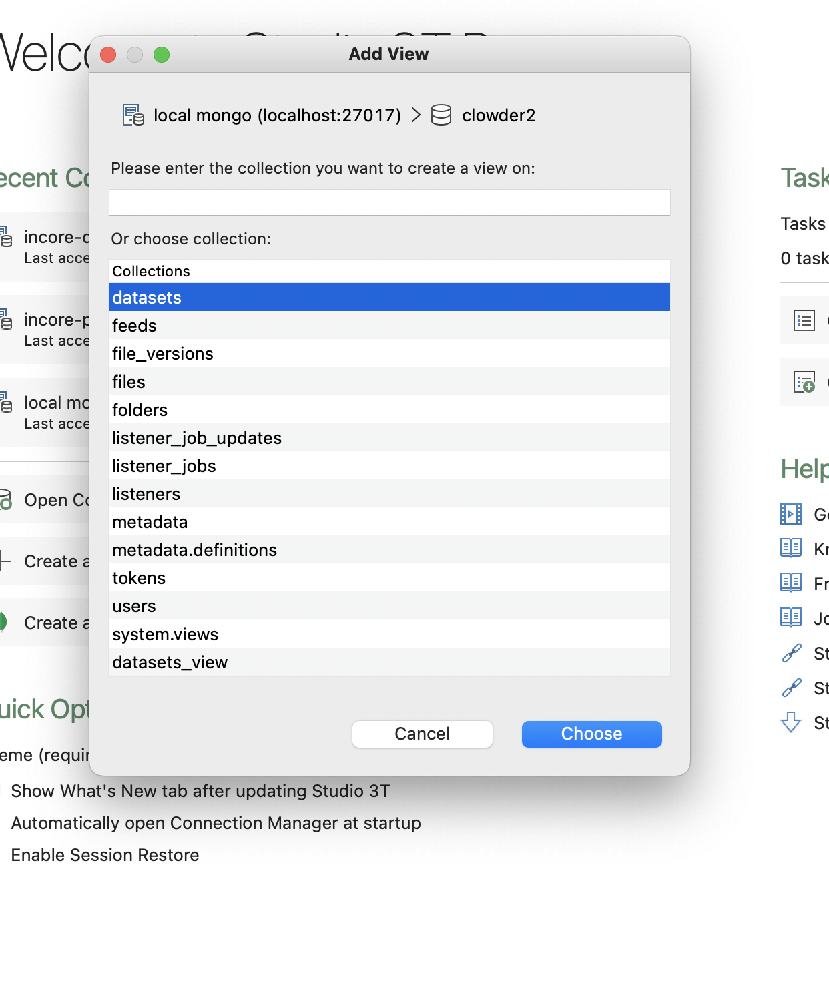
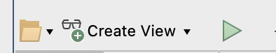

# How to Import Views from Query Script

- Open Studio 3T
- Find the Views section and right click
- Select **Add Views**
  
- Select the collectino you want to base your view on. E.g. If you are importing **datasets_view.js**, you need to
  select datasets collection
  
- In the new interface, click the folder icon and select the view query script. e.g. **datasets_view.js**
  
- Click the **triangle "run"** button to test.
- If everything looks good, click the **create view** button, save it with the name following `collection name` +
  `_view` pattern.
